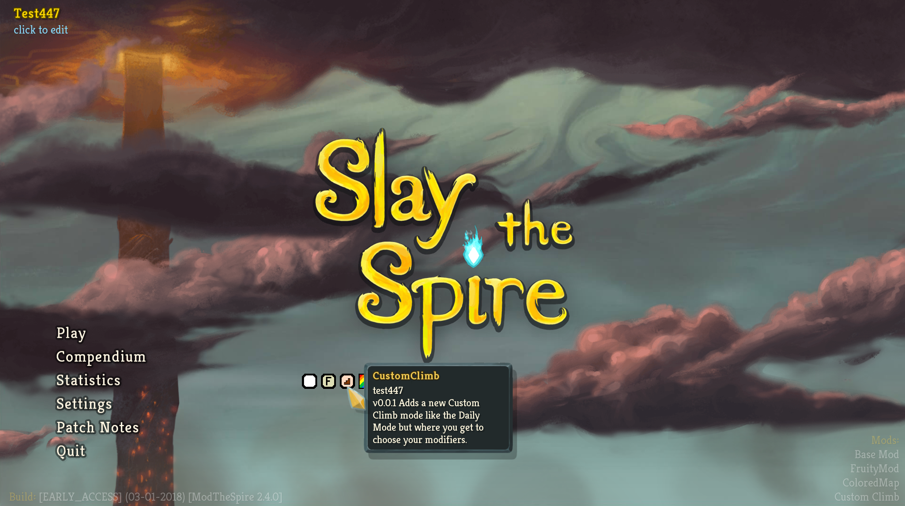
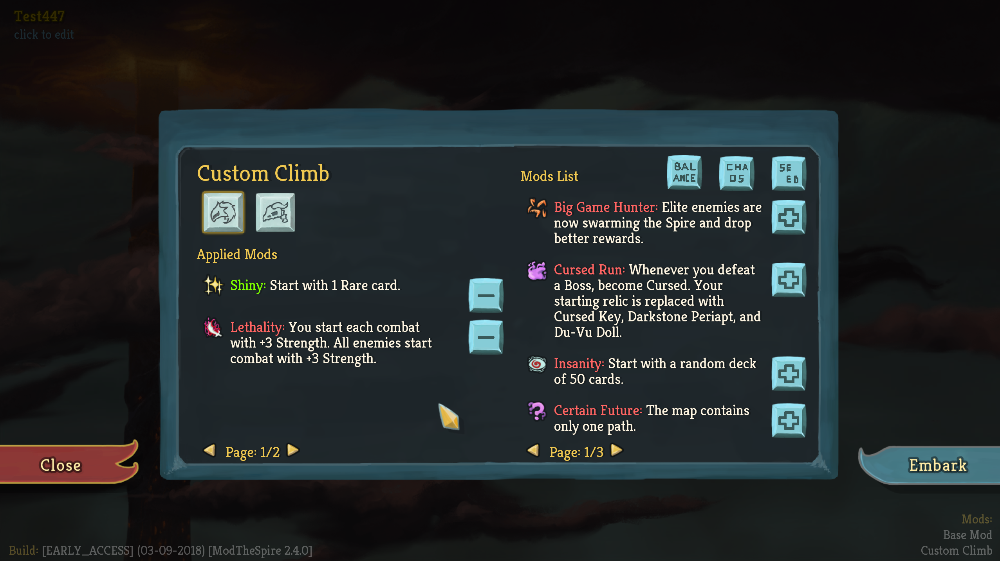
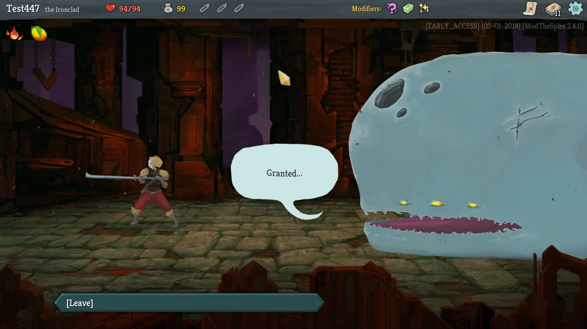
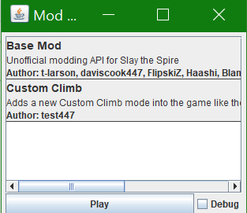
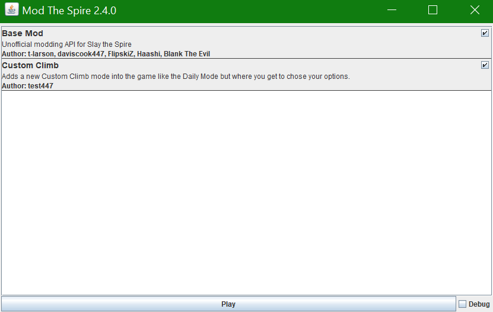

# Custom Climb #
Custom Climb lets you do challenge runs how **you** want to do them not how the randomized daily runs do. When playing in Custom Climb mode you get to **choose** which positive and negative modifiers are going to effect your run and which character you want to play as.

To open the *Custom Climb Menu* click on the icon with the brown staircase. This will open the modifier select screen.

On the *Modifier Select Screen* you can chose your modifiers for the run. First select a character using the Ironclad or Silent button. This will make the embark button available. The **Applied Mods** list shows what mods will be applied for your custom climb. The **Mods List** shows you all the possible mods that you can apply to your custom climb. Notice that under both lists there are left and right arrows. This is because there are more mods than can be displayed at once so you need to use the arrows to navigate to all the possible mods.

Once in game the custom climb will act like a daily climb. All of the mods are applied **and** you will not be able to save and quit without losing your progress.

## Known Bugs ##
1. Some modifiers will not work properly with Custom Characters. This issue **will not** be fixed right now so there's no need to make issues about it.

## Installation ##
1. If you have `ModTheSpire` already installed you can skip to step 5. Otherwise continue with step 2:
2. Download `ModTheSpire.jar` from the latest release (https://github.com/kiooeht/ModTheSpire/releases)
3. Move `ModTheSpire.jar` into your **Slay The Spire** directory. This directory is likely to be found under `C:\Program Files (x86)\Steam\steamapps\common\SlayTheSpire`. Place `ModTheSpire.jar` in that directory so it looks like `C:\Program Files (x86)\Steam\steamapps\common\SlayTheSpire\ModTheSpire.jar`
4. Create a `mods` folder in your **Slay The Spire** directory so it looks like `C:\Program Files (x86)\Steam\steamapps\common\SlayTheSpire\mods`
5. Download `BaseMod.jar` from the latest release (https://github.com/daviscook477/BaseMod/releases)
6. Move `BaseMod.jar` into the `mods` folder you created in step 4
7. Download `CustomClimb.jar` from the latest release (https://github.com/daviscook477/CustomClimb/releases)
8. Move `CustomClimb.jar` into the `mods` folder you created in step 4
9. Your modded version of **Slay The Spire** can now be launched by double-clicking on `ModTheSpire.jar`
10. This will open a mod select menu where you need to make sure that both `BaseMod` and `CustomClimb` are checked before clicking **play**

If when opening up **ModTheSpire** you **don't** see any checkboxes for letting you chose which mods are installed you need to resize the window to be bigger.

## Roadmap ##
1. Fix bugs as they arise
2. Allow for setting and sharing seeds (so you can have the exact same run as someone else or give someone a specific seed and set of modifiers as a challenge)
3. Add more Daily modifier options so runs can be even more customized
4. Make Custom Runs possible to be saved and reloaded

## Credits ##
* Mod by test447
